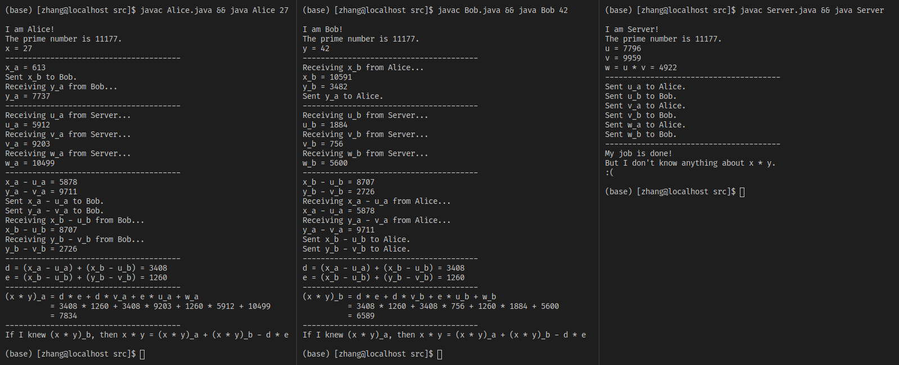

# secure-multiplication-demo

A demo of three-party secure multiplication.

## Problem Description
Each of the two players, **Alice** and **Bob**, has an non-negative integer that is smaller than a large prime number `PRIME`, `x` and `y` respectively. Alice and Bob want to know the product of `x` and `y`, but neither of them want their input known by the other player. To meet this requirement, we introduce a third player, **Server**, to generate and distribute "masks" `u`, `v`, and `w` to Alice and Bob.

This requirement seems absurd for two numbers' multiplication: if, say, Alice knows `x` and `x * y`, she can easily recover `y` by multiplying `x * y` by `x ^ -1`. However, if there are three or more numbers to be multiplied together, none of the players can recover other players' inputs from the product. And the solution in this demo can be easily extended to the occasions where there are three or more numbers to be multiplied.


## How to run the demo
Both `Alice` and `Bob` takes an argument as their input for the multiplication:
```shell script
javac Bob.java && java Bob 42
```

```shell script
javac Alice.java && java Alice 27
```

`Server` doesn't take arguments:
```shell script
javac Server.java && java Server
```
Note that you should run `Alice` after `Bob`, and `Server` after `Alice`; otherwise there would be Sockets issues since these three processes are not multi-threaded.

It is recommended that you run the three processes in three vertically aligned terminals. A screenshot of the running demo is shown below.




## How to improve
* Since this is just a demonstration of the idea, the processes are not programmed using multi-threading and have to be run in a certain sequence, otherwise they will not communicate with each other properly. In a more realistic project this cannot happen.
* Class `Alice` and `Bob` could be deduplicated, since they share very similar codes.
* Perhaps I should make the multiplication protocol a separate class which is taken in by the constructors of `Player`'s, so that the `Player`'s would do according to the protocol. This is a way of deduplication, as well as a way of extension to more protocols.


## References
_A Pragmatic Introduction to
Secure Multi-Party Computation_, Section 3.4.
